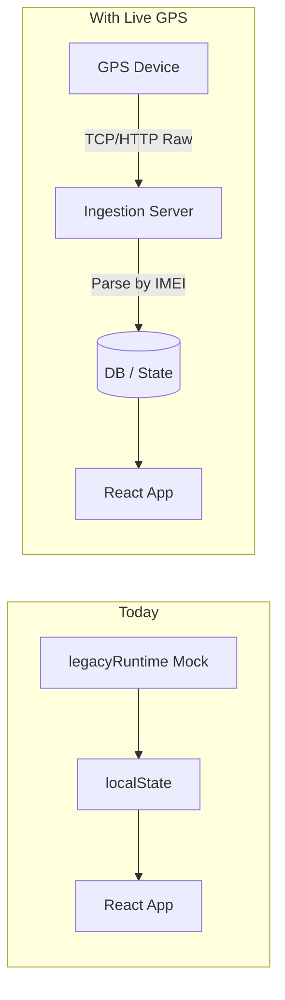
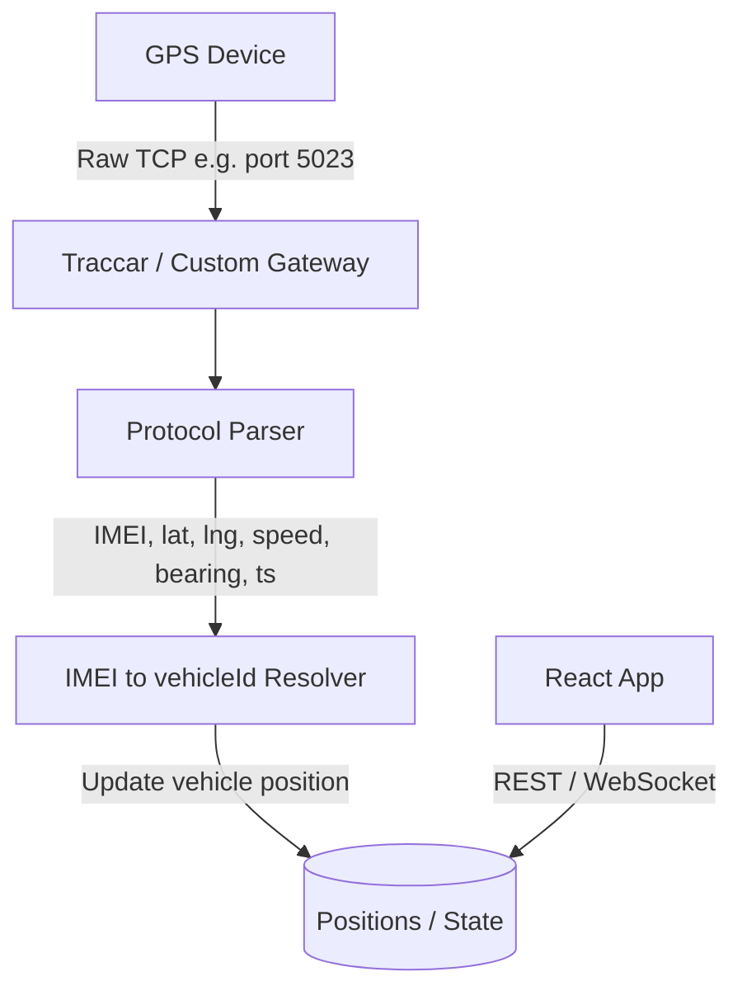

# GPS Assignment and Integration Plan

Plan for integrating generic GT06-style GPS trackers with the CASAN app: protocol parsing, assignment prerequisites, ingestion architecture options, and app changes needed to consume live telemetry.

---

## 1. Protocol Analysis

The sample uses a GT06/Concox-style binary-like protocol. From a typical packet:

```
&&j134,862608083128105,000,0,,260304042441,A,-6.301005,106.685455,7,1.1,0,9,58,1334,...
```

**Extractable fields:**

| Field     | Position / pattern           | Example                | Purpose                              |
| --------- | ---------------------------- | ---------------------- | ------------------------------------ |
| IMEI      | 2nd CSV field, 15 digits     | `862608083128105`      | Device identity (key for assignment) |
| Timestamp | YYMMDDHHMMSS                 | `260304042441`         | Last ping time                       |
| Fix       | A/V                          | `A`                    | Valid (A) or invalid (V) fix         |
| Lat       | Decimal                      | `-6.301005`            | Latitude                             |
| Lon       | Decimal                      | `106.685455`           | Longitude                            |
| Speed     | km/h                         | `1.1`                  | Speed                                |
| Bearing   | degrees                      | `9`                    | Heading                              |
| Cell info | MCC/MNC/LAC/CellID           | `510|89|7E9A|04D8EEC1` | Signal context                       |
| Battery   | In `ext_v:` / `bat_v:` lines | `bat_v:3720mv`         | Battery voltage                      |

Parsing rule: split on `,`; IMEI is the 15-digit numeric field after the sequence; lat/lon are the first two decimal numbers after the fix flag.

---

## 2. Current App Model (Assignment Prerequisites)

The app already supports assignment. What it needs:

- **GPS device record** with `imei` (15 digits) in `state.gpsDevices`
- **Assignment** via `gps.vehicleId` linking device to vehicle
- **Position** on `vehicle.lat`, `vehicle.lng` for map/list display

**Existing flows:**

| Action            | Where                                                   | API                                                           |
| ----------------- | ------------------------------------------------------- | ------------------------------------------------------------- |
| Create GPS        | [GpsView.jsx](web/src/components/GpsView.jsx)           | `createGps({ imei, brand, model, vehicleId?, sim })`          |
| Assign to vehicle | [VehiclesView.jsx](web/src/components/VehiclesView.jsx) | `updateGps(gpsId, { vehicleId })`                             |
| Bulk import       | GpsView                                                 | CSV: `imei,brand,model,carrier,simNumber,simExpiry,vehicleId` |
| Unassign          | VehiclesView                                            | `updateGps(gpsId, { vehicleId: null })`                       |

**Assignment prerequisite:** Device IMEI must exist in the app before telemetry can be matched. Unknown IMEIs are currently ignored (no auto-registration).

---

## 3. Data Flow Today vs. With Live GPS



- **Today:** `legacyRuntime` seeds vehicles with mock `lat`/`lng`; no external ingestion.
- **With live GPS:** Device sends raw packets; ingestion parses by IMEI, resolves `vehicleId`, and updates position/status.

---

## 4. Ingestion Architecture Options

| Option                                         | Pros                                             | Cons                                                  | Best for                                            |
| ---------------------------------------------- | ------------------------------------------------ | ----------------------------------------------------- | --------------------------------------------------- |
| **A) Third-party platform (Traccar, OpenGTS)** | No parsing code; REST API; maps, reports, alerts | Vendor lock-in; extra infra; may need protocol plugin | Fast MVP; ops prefer off‑the‑shelf                  |
| **B) Custom middleware (Node/Python)**         | Full control; match CASAN schema; GT06 decoder   | Build and maintain parser + server                    | When you need a CASAN-native pipeline               |
| **C) Backend-first (CASAN API)**               | Single backend; auth, RBAC, audit                | Depends on Phase 2 backend                            | After Phase 2 - Data Platform is live               |

**Recommended sequence:**

1. **Short term:** Use Traccar (or similar) as the GPS receiver. Configure GT06 protocol, point devices to Traccar. App consumes Traccar REST API for positions; assignment stays in CASAN (IMEI ↔ vehicle sync).
2. **Medium term:** Add a small CASAN middleware that receives raw packets (or MQTT/WebSocket from a gateway), parses protocol, and writes to your future backend.
3. **Long term:** Once Phase 2 backend exists, integrate ingestion into that API; app uses backend as single source of truth.

---

## 5. Best Way to Attach: End-to-End Flow



**Steps:**

1. **Register device in app:** Create GPS (or bulk import) with IMEI `862608083128105` and assign to vehicle.
2. **Device configuration:** Set device server IP/port to your ingestion gateway (Traccar or custom).
3. **Gateway:** Receives raw packets, parses GT06, extracts IMEI + position.
4. **Resolver:** For each packet, look up `gpsDevices.find(d => d.imei === imei)` → `vehicleId` → update `vehicle.lat`, `vehicle.lng`, `vehicle.lastPingAt`, `gps.status`.
5. **App:** Consumes updated state via REST poll or WebSocket (Phase 3).

---

## 6. App Changes Required

| Area                | Change                                                                                                            |
| ------------------- | ----------------------------------------------------------------------------------------------------------------- |
| **Assignment UX**   | Already sufficient. Optional: "Register from IMEI" if packet arrives for unknown IMEI.                            |
| **Data source**     | Replace `legacyRuntime` mock with API calls (or bridge that fetches from backend).                                |
| **Position update** | Ensure `vehicle.lat`, `vehicle.lng`, `vehicle.lastPingAt`, `gps.status`/`lastPingAt` are writable from ingestion. |
| **Real-time**       | Add WebSocket or short polling for map/list when Phase 3 is implemented.                                          |

**No protocol parsing in the React app.** Parsing belongs in the gateway/backend.

---

## 7. Protocol Parser Skeleton (for Custom Middleware)

If you build a custom gateway, a minimal parser:

```javascript
// Example: parse one packet line
// Input: "server1 send:&&j134,862608083128105,000,0,,260304042441,A,-6.301005,106.685455,7,1.1,..."
function parseGt06Packet(line) {
  const match = line.match(/&&\w(\d+),(\d{15}),[^,]*,[^,]*,[^,]*,[^,]*,([AV]),([-\d.]+),([-\d.]+),([\d.]+),([\d.]+)/);
  if (!match) return null;
  const [, seq, imei, fix, lat, lon, , speed, bearing] = match;
  const ts = parseTimestamp(match[0].match(/(\d{12})/)?.[1]); // YYMMDDHHMMSS
  return { imei, lat: parseFloat(lat), lon: parseFloat(lon), speed: parseFloat(speed), bearing: parseInt(bearing, 10), fix: fix === 'A', timestamp: ts };
}
```

---

## 8. Summary: What You Need

| Need                        | Status / Action                                            |
| --------------------------- | ---------------------------------------------------------- |
| GPS device record with IMEI | Create in GpsView or bulk import CSV                       |
| Assign GPS to vehicle       | Use VehiclesView "Add GPS" flow                            |
| Device configuration        | Point device to your gateway IP:port                       |
| Ingestion gateway           | Traccar (quick) or custom parser (flexible)                |
| IMEI → vehicle resolution   | Lookup `gpsDevices` by IMEI → `vehicleId` → update vehicle |
| App consuming live data     | Replace mock with API; add WebSocket in Phase 3            |

**Fastest path:** Register IMEI in app, assign to vehicle, deploy Traccar, configure devices to Traccar, then build a small sync service from Traccar API → CASAN state until the Phase 2 backend exists.
